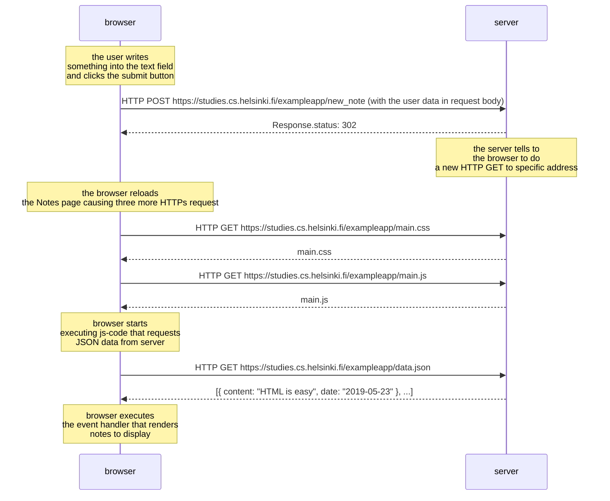

## Diagram for a user creates a new note

```mermaid
sequenceDiagram

note over browser: the user writes<br/>something into the text field<br/>and clicks the submit button

browser->>server: HTTP POST https://studies.cs.helsinki.fi/exampleapp/new_note (with the user data in request body)
server-->>browser: Response.status: 302

note over server: the server tells to<br/>the browser to do<br/>a new HTTP GET to specific address

note over browser: the browser reloads<br/>the Notes page causing three more HTTPs request

browser->>server: HTTP GET https://studies.cs.helsinki.fi/exampleapp/main.css
server-->>browser: main.css
browser->>server: HTTP GET https://studies.cs.helsinki.fi/exampleapp/main.js
server-->>browser: main.js

note over browser: browser starts<br/>executing js-code that requests<br/>JSON data from server

browser->>server: HTTP GET https://studies.cs.helsinki.fi/exampleapp/data.json
server-->>browser: [{ content: "HTML is easy", date: "2019-05-23" }, ...]

note over browser: browser executes<br/>the event handler that renders<br/>notes to display

```
